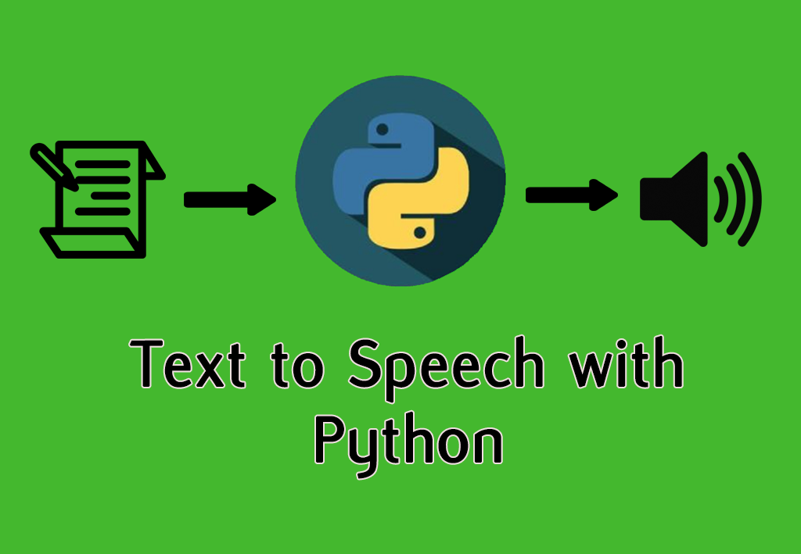

# Articles text to Speech



_By: Meqdad Darweesh_

Convert the text of articles to speech using nltk, newspaper and gTTS with Python.

## What I did?

In this [code](text_to_speech.py), I've used Python with multiple libraries:

### nltk
_Natural Language Toolkit_, visit: https://www.nltk.org/

### gTTS
_Google Text-to-Speech_, a Python library and CLI tool to interface with Google Translate's text-to-speech API.
For more details, visit: https://gtts.readthedocs.io/en/latest/

### newspaper
_newspaper library_, visit: https://newspaper.readthedocs.io/en/latest/

### Output sample:

In this code example, I've used this article:
[Coronavirus: How can AI help fight the pandemic?](https://www.bbc.com/news/technology-51851292) from BBC News.

```
First 250 character of the article:
 Image copyright Getty Images Image caption There is growing fear about the spread of the virus

Executives from Amazon, Google, Microsoft, Apple and Facebook met officials at Downing Street on Wednesday to discuss their role in 
the coronavirus crisis
```
You can check the audio file as a result of this execution.

_Meqdad_

### License
[MIT](LICENSE)